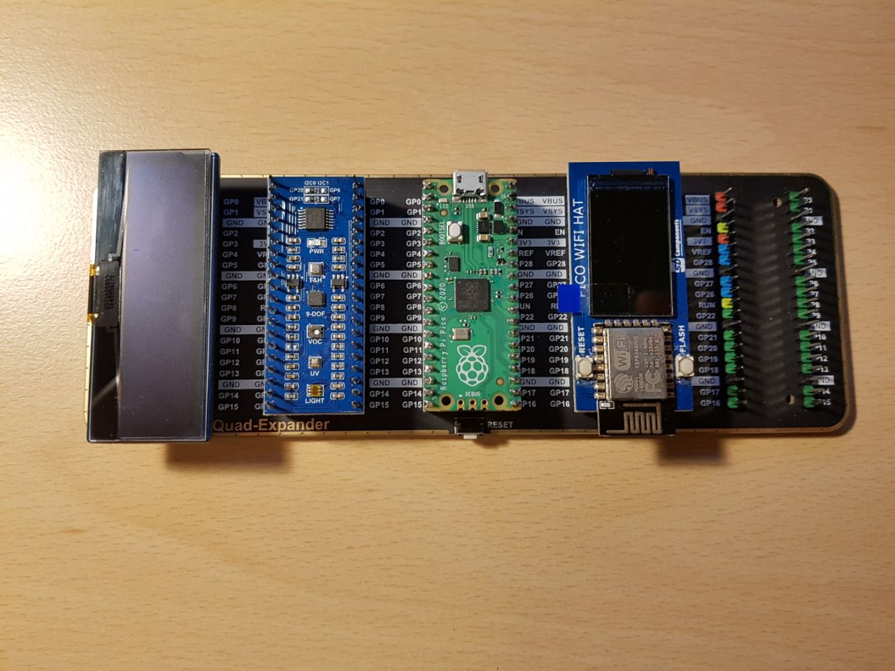

# Raspberry Pi Pico with Micropython

W folderze `demos` znajdują się programy napisane na podstawie książki **Get started with MicroPython on Raspberry Pi Pico**. \
\
Program `hcsr04.py` służy do obsługi ultradźwiękowego czujnika odległości *HC-SR04*. \
\
Pozostałe programy obsługują stację pogodową zbudowaną przy pomocy Rasperry Pi Pico. \
Wyniki stacji można oglądać pod linkiem: [UBIDOTS](https://stem.ubidots.com/app/dashboards/public/dashboard/rWQIP3C1d13KOGR6h3PSUW8zFSSjXVMhlgv3p_GasT4).
